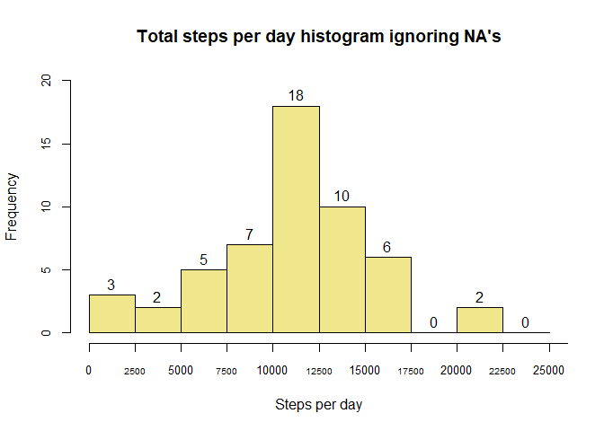

The data for this assignment can be downloaded from the course web site:

* Dataset: [Activity monitoring data data](https://d396qusza40orc.cloudfront.net/repdata%2Fdata%2Factivity.zip)  
  
The variables included in this dataset are:  

* **steps:** Number of steps taking in a 5-minute interval (missing values are coded as NA)  
* **date:** The date on which the measurement was taken in YYYY-MM-DD format  
* **interval:** Identifier for the 5-minute interval in which measurement was taken


## 1. Loading and preprocessing the data
Loading libraries

```r
library(dplyr)
library(readr)
```

Unziping the activity.csv file, if needed

```r
if (!file.exists("/activity.csv")){unzip("activity.zip")}
```

Loading data

```r
activity <- read_csv("activity.csv")
head(activity)
```

```
## # A tibble: 6 x 3
##   steps date       interval
##   <dbl> <date>        <dbl>
## 1    NA 2012-10-01        0
## 2    NA 2012-10-01        5
## 3    NA 2012-10-01       10
## 4    NA 2012-10-01       15
## 5    NA 2012-10-01       20
## 6    NA 2012-10-01       25
```


## 2. What is mean total number of steps taken per day?
Calculating TOTAL steps per each day of the activity dataset. For this part of the assignment, missing values are ignored.

```r
steps_per_day<- activity %>%
        na.omit() %>%
        group_by(date) %>%
        mutate(total=sum(steps)) %>%
        select(date, total) %>%
        unique()

head(steps_per_day)
```

```
## # A tibble: 6 x 2
## # Groups:   date [6]
##   date       total
##   <date>     <dbl>
## 1 2012-10-02   126
## 2 2012-10-03 11352
## 3 2012-10-04 12116
## 4 2012-10-05 13294
## 5 2012-10-06 15420
## 6 2012-10-07 11015
```
**2.1 Make a histogram of the total number of steps taken each day**

```r
hist(steps_per_day$total,
     breaks = seq(0,25000, by=2500),
     main="Total steps per day histogram ignoring NA's",
     xlab="Steps per day",
     col="khaki",
     cex.axis=0.8,
     ylim=c(0,20),
     labels = TRUE)
axis(side=1, at=seq(2500,250000, 5000), labels=seq(2500,250000, 5000), cex.axis=0.6)
```

<!-- -->

**2.2 Calculate and report the mean and median total number of steps taken per day**

```r
median<-median(steps_per_day$total) %>%
        round(digits = 2) %>%
        format(scientific=FALSE)

mean<-mean(steps_per_day$total) %>%
        round(digits = 2) %>%
        format(scientific=FALSE, decimal.mark = ",")
```
Median steps taken per day is 10765. The mean of steps taken per day is 10766,19.


## 3. What is the average daily activity pattern?
Calculating the average of steps taken per each interval

```r
mean_per_interval<- activity %>%
        group_by(interval) %>%
        summarise(steps_mean=mean(steps, na.rm=TRUE))

head(mean_per_interval)
```

```
## # A tibble: 6 x 2
##   interval steps_mean
##      <dbl>      <dbl>
## 1        0     1.72  
## 2        5     0.340 
## 3       10     0.132 
## 4       15     0.151 
## 5       20     0.0755
## 6       25     2.09
```
**3.1 Make a time series plot of the 5-minute interval (x-axis) and the average number of steps taken, averaged across all days (y-axis)**

```r
plot(x=mean_per_interval$interval,
     y=mean_per_interval$steps_mean,
     type="l",
     col="blue4",
     xlab="Interval",
     ylab="Mean per interval",
     main="Average number steps per intervals",
     xaxt="n")
axis(side=1, at=seq(0,2400, 300), labels=seq(0,2400, 300), cex.axis=0.8)
```

<!-- -->

**3.2 Which 5-minute interval, on average across all the days in the dataset, contains the maximum number of steps?**

```r
mean_per_interval$interval[which.max(mean_per_interval$steps_mean)]
```

```
## [1] 835
```


## 4. Imputing missing values
There are a number of days/intervals where there are missing values (coded as NA). The presence of missing days may introduce bias into some calculations or summaries of the data.

**4.1 Calculate and report the total number of missing values in the dataset**

```r
sum(is.na(activity$steps))
```

```
## [1] 2304
```

**4.2 Devise a strategy for filling in all of the missing values in the dataset. The strategy does not need to be sophisticated. For example, you could use the mean/median for that day, or the mean for that 5-minute interval, etc.**  
Missing values will be replaced with the mean for 5-minute interval

**4.3 Create a new dataset that is equal to the original dataset but with the missing data filled in.**

```r
new_dataset<-activity
new_dataset$steps[is.na(new_dataset$steps)]<-mean_per_interval$steps_mean
head(new_dataset)
```

```
## # A tibble: 6 x 3
##    steps date       interval
##    <dbl> <date>        <dbl>
## 1 1.72   2012-10-01        0
## 2 0.340  2012-10-01        5
## 3 0.132  2012-10-01       10
## 4 0.151  2012-10-01       15
## 5 0.0755 2012-10-01       20
## 6 2.09   2012-10-01       25
```
**4.4 Make a histogram of the total number of steps taken each day and calculate and report the mean and median total number of steps taken per day. Do these values differ from the estimates from the first part of the assignment? What is the impact of imputing missing data on the estimates of the total daily number of steps?**
        
Calculating TOTAL steps per each day of the new_dataset.

```r
new_steps_per_day<- new_dataset %>%
        group_by(date) %>%
        mutate(total=sum(steps)) %>%
        select(date, total) %>%
        unique()
head(new_steps_per_day)
```

```
## # A tibble: 6 x 2
## # Groups:   date [6]
##   date        total
##   <date>      <dbl>
## 1 2012-10-01 10766.
## 2 2012-10-02   126 
## 3 2012-10-03 11352 
## 4 2012-10-04 12116 
## 5 2012-10-05 13294 
## 6 2012-10-06 15420
```

Making histogram of total steps per day with NA's replaced and comparing it with the old one

```r
par(mfrow=c(1,2), oma = c(0, 0, 2.5, 0))
hist(new_steps_per_day$total,
     breaks = seq(0,25000, by=2500),
     main="With NA's replaced",
     cex.main=0.9,
     xlab="Steps per day",
     col="khaki",
     cex.axis=0.6,
     ylim=c(0,27),
     labels = TRUE)

hist(steps_per_day$total,
     breaks = seq(0,25000, by=2500),
     main="Ignoring NA's",
     cex.main=0.9,
     xlab="Steps per day",
     col="khaki",
     cex.axis=0.6,
     ylim=c(0,27),
     labels = TRUE)

mtext("Total steps per day histogram", outer = TRUE, cex=1.5)
```

<!-- -->

Mean and median total number of steps taken per day when NA's are replaced

```r
new_median<-median(new_steps_per_day$total, na.rm = TRUE) %>%
        round(digits = 2) %>%
        format(scientific=FALSE)

new_mean<-mean(new_steps_per_day$total, na.rm = TRUE) %>%
        round(digits = 2) %>%
        format(scientific=FALSE, decimal.mark = ",")
```

Comparing mean and median total number of steps per day:  
        
**When NA's are replaced:**  
Median is 10766.19  
Mean is 10766,19  

**When NA's are ignored (2.2 part of the assigment):**  
        Median is 10765  
Mean is 10766,19


## 5. Are there differences in activity patterns between weekdays and weekends?
For this part, dataset with the filled-in missing values (new_dataset) is used.

```r
Sys.setlocale("LC_ALL","English")
```

**5.1 Create a new factor variable in the dataset with two levels -- "weekday" and "weekend" indicating whether a given date is a weekday or weekend day.**

```r
new_dataset$day_name<-weekdays(new_dataset$date)

new_dataset<- new_dataset %>%
        mutate(day_name = replace(day_name, day_name !=c("Sunday","Saturday"), "Weekday")) %>%
        mutate(day_name = replace(day_name, day_name !="Weekday", "Weekend"))
head(new_dataset)
```

```
## # A tibble: 6 x 4
##    steps date       interval day_name
##    <dbl> <date>        <dbl> <chr>   
## 1 1.72   2012-10-01        0 Weekday 
## 2 0.340  2012-10-01        5 Weekday 
## 3 0.132  2012-10-01       10 Weekday 
## 4 0.151  2012-10-01       15 Weekday 
## 5 0.0755 2012-10-01       20 Weekday 
## 6 2.09   2012-10-01       25 Weekday
```

**5.2 Make a panel plot containing a time series plot of the 5-minute interval (x-axis) and the average number of steps taken, averaged across all weekday days or weekend days (y-axis).**


```r
weekdays<-new_dataset %>%
        filter(day_name=="Weekday") %>%
        group_by(interval) %>%
        summarise(steps_mean=mean(steps))

weekends<-new_dataset %>%
        filter(day_name=="Weekend") %>%
        group_by(interval) %>%
        summarise(steps_mean=mean(steps))


par(mfrow=c(1,2), oma = c(0, 0, 2, 0))
plot(x=weekdays$interval,
     y=weekdays$steps_mean,
     type="l",
     col="blue4",
     xlab="Interval",
     ylab="Mean per interval",
     main="During weekdays",
     cex.main=0.8)

plot(x=weekends$interval,
     y=weekends$steps_mean,
     type="l",
     col="blue4",
     xlab="Interval",
     ylab="Mean per interval",
     main="During weekends",
     cex.main=0.8)

mtext("Average number steps per intervals, NA's replaced", outer = TRUE, cex=1.5)
```

<!-- -->

